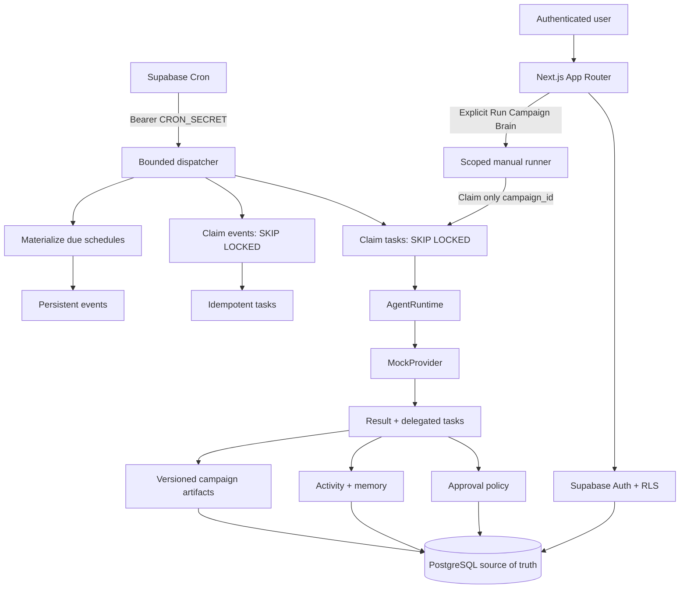

# Architecture

Spectro uses Next.js App Router on Vercel and Supabase for Auth, Postgres, Storage, and future Realtime. Server Components read user-scoped data through RLS. An HttpOnly organization-context cookie selects one of the authenticated user's memberships and is revalidated on every request. Route Handlers validate mutations with Zod. The bounded worker and authenticated Campaign Brain service keep the service role server-only.

PostgreSQL owns state; workers are bounded; locks prevent duplicate claims; unique organization-scoped keys prevent duplicate intent; leases repair interrupted work; approvals and autonomy are deterministic; providers cannot override policy.

M01.1 adds defense in depth: sensitive configuration writes are owner/admin-only, notification rows are user-private, cross-organization foreign references are rejected by triggers, approval decisions use an audited RPC, and the last owner cannot be removed. `AUTOMATION_ENABLED` is a server-only kill switch; preview and test environments remain disabled even if the flag is accidentally true.

M02.1 extends the same runtime rather than adding a workflow engine. The campaign-scoped claim function is unavailable to `anon` and `authenticated`; an authorized Route Handler validates membership and role before the server-only runner uses it. Each provider result is Zod-validated and persisted by task type. Research, channels, pillars, angles, messaging and strategy snapshots retain `organization_id`, `campaign_id` and `strategy_version`. The final task runs deterministic brand guardrails, marks the campaign `ready`, and creates an approval. Approval never publishes or enables automation.
