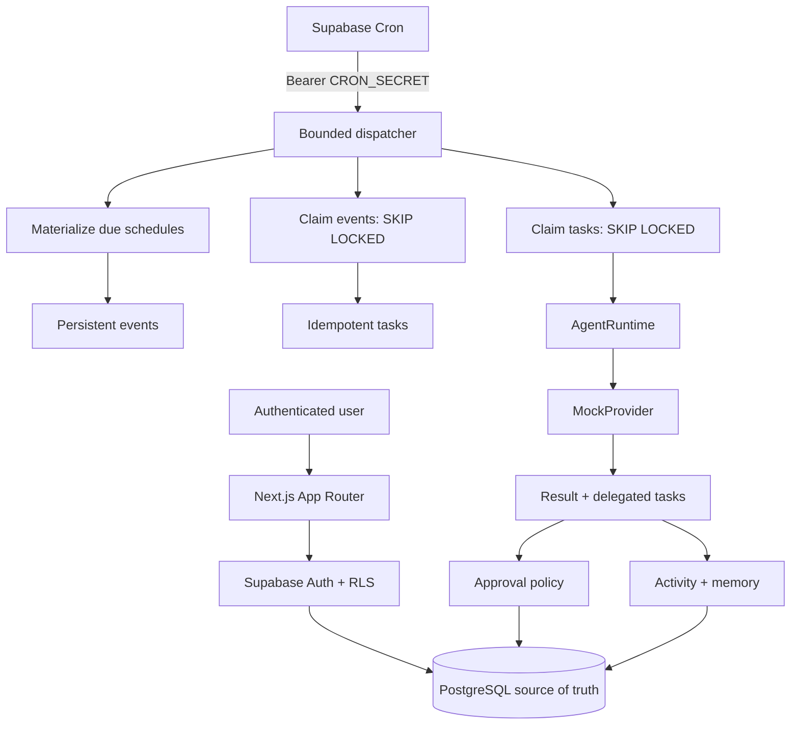

# Architecture

M01 uses Next.js App Router on Vercel and Supabase for Auth, Postgres, Storage, and future Realtime. Server Components read user-scoped data through RLS. Route Handlers validate mutations with Zod. Only the internal dispatcher uses the service role.

PostgreSQL owns state; workers are bounded; locks prevent duplicate claims; unique organization-scoped keys prevent duplicate intent; leases repair interrupted work; approvals and autonomy are deterministic; providers cannot override policy.
